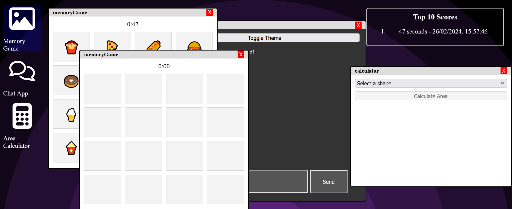

# A3 SPA
This is a single page application (SPA) simulating a personal web desktp (PWD). It looks like this: 

The background image and icons are svgs, so they take less space. The clock in the footer is accurate and the programs are different.
The first program, Memory is a game where you try to match images, two at a time, by remembering where the matching image was when it was turned up last. It's a classic game and here the images are food emojis and there is also a timer recording your speed into a highscore list on the desktop.
The second program is a chat app, where you can chat with people online. You can choose a username and choose between dark and light theme. You can't choose a channel since that was an extended requirement and I'm late enough as is, so you're always chatting in the 'undefined' channel if I recall correctly.
The third program is an area calculator where you choose a shape, enter the lenghts of certain parts of these shapes and the program calculates the area of the shape.
To run this website, you need to first install all the dependancies by opening the project folder in a terminal and writing
'npm install'
. For some reason, the npm run build command doesn't build the program correctly with file paths, so to start a webserver, write the command
'npm run http-server ./src'
and then go to localhost:8080 on a web browser.
Here is the presentation video: [video link](https://youtu.be/_RRk7oA_6g4)